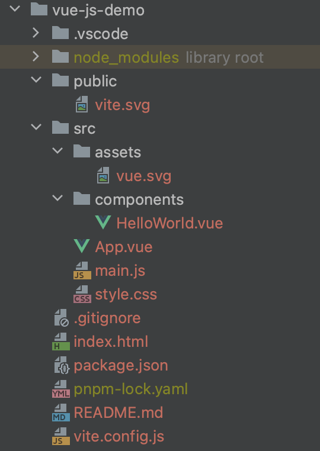

# 2、[Vue速成]使用vite创建vue项目

### vite 是什么？为什么要使用它？

> vite是一个构建工具，它改善了前端开发体验。他建立一个具有热重载功能的开发环境，串联前端开发的各种工具，使我们可以通过一条指令，即可快速的启动，快捷方便，让我们专注于业务开发。例：我们传统的web前端开发依赖的就是js+html+css，某一天我们需要添加css预处理sass,需要添加typescript，每次改完界面之后我们需要浏览器自动刷新，响应我们的变动，那么我们需要执行三个指令，1、编译sass文件的指令，2、编译ts的指令，3、监听界面文件改动后通知浏览器刷新的指令。当然还有无数的工具，每一个工具都需要执行各自的指令，这是很麻烦的事情，而vite就是将这些指令串联起来，自动执行的这么一个统筹工具。

* 类似的工具还有很多，比如：webpack、rollup、parcel之类的，但是依照当前的使用综合能力来看，vite的表现和受欢迎层度是最好的（注：vite在打包的时候使用的Rollup，开发环境使用的是浏览器的模块化支持特性，提高了热更新的效率）。

### 初始化一个vite项目

```shell
# 1、使用pnpm指令直接创建一个名为vue-js-demo的项目,项目模板使用 vue3 + js的基础目标
pnpm create vite vue-js-demo --template vue

# 进入创建的目录
cd vue-js-demo
# 安装依赖包
pnpm install

# 运行开发环境(通过npm运行项目中的脚本，参考上一节，如果运行有误，请查看package.json中是否有```"type": "module",```,请删除掉该字段后再次运行)
npm run dev

```
* 上面指令就创建了一个基础项目：```https://github.com/libwiki/vue-quick/vue-js-demo```
* 我们上面加入了```--template```选项就是指定使用的模板，他也可以使用其他模板(react等)，或者一个单纯的前端项目，详细请参考[vite官方文档](https://cn.vitejs.dev/guide/)
* 上述操作后得到的一个项目源文件如下：

* 执行```npm run dev```后通过浏览器访问```http://127.0.0.1:5173/``` 可得到如下界面


### vite项目的配置文件```vite.config.js```
* 该文件是在vite项目跟目录下的配置文件（一般是不需要改动的）
* 如果需要自定一些配置，请参考官网：```https://cn.vitejs.dev/config/``
* 由于配置比较多，也比较枯燥，不利于文本照搬，此处略过；一些常用的配置、或者一些打包注意点的相关的配置，后续需要使用会穿插的提到（注：如果是初学者千万不要先深入vite的配置或者插件的原理，不然会卡在这里，因为这是前端其他分支的内容，我们本系列的注重点在于vue开发，vite就只是一个工具，项目运行起来后，我们大部分时候是不怎么关心它的。我们首先要学会运用它！熟练运用之后再去学习怎么维修它，至于什么时候才是去学习它的时期？知识到了一定的界限它会自然而然的指引着我们去探究的）。